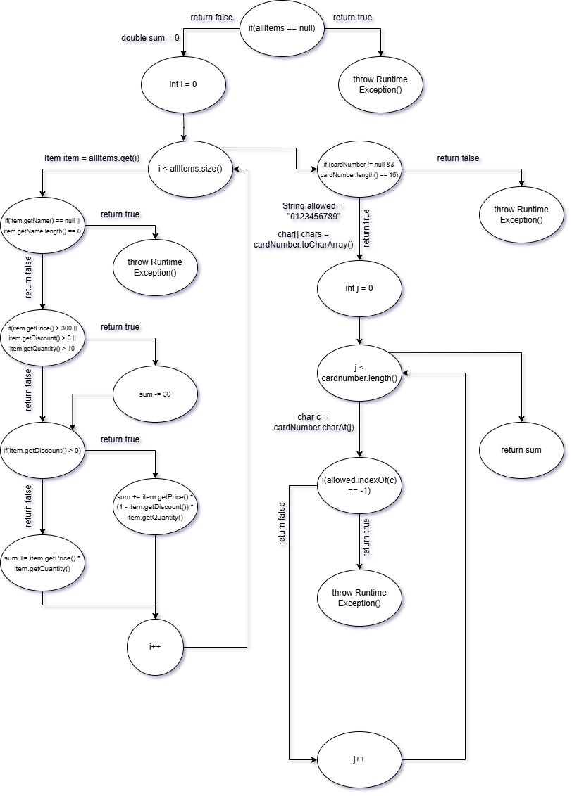

Орце Наумовски 206049 

2. CFG

3. Cyclomatic complexity
-Цикломатската комплексност на кодот е 9. До резултатот стигнав со формулата V(G) = P + 1,
 каде што P е бројот на predicate јазли. Тие јазли се:
 -> if (allItems == null)
 -> i < allItems.size() - дел од for циклусот
 -> if (item.getName() == null || item.getName().length() == 0)
 -> if (item.getPrice() > 300 || item.getDiscount() > 0 || item.getQuantity() > 10)
 -> if (item.getDiscount() > 0)
 -> if (cardNumber != null && cardNumber.length() == 16)
 -> j < cardNumber.length()  - дел од for циклусот
 -> if (allowed.indexOf(c) == -1)

4. Тест случаеви според Every statement критериумот
-Test case 1: Листата e null - 
 checkCart(null, "1234567891011121") - со овој test case влегува во првиот statement 
и фрла exception(листата не може да е null)

-Test case 2: Името/Должината на името на Item е null/0 - 
 checkCart(List.of(new Item(null, 1, 100, 0)), "1234567891011121") - со овој test case
влегува во вториот statement и фрла exception(item oд листата не може да нема име или 
должината на името да е null)

-Test case 3: Цена поголема од 300, попуст поголем од 0 и количина поголема од 10 -
 checkCart(List.of(new Item("Item1", 20, 400, 10), "1234567891011121") - со овој test case
влегува во двата наредни if-услови и оди до крај бидејќи бројот на картата е валиден
(содржи 16 карактери и сите се од рангот од 0 до 9)

-Test case 4: Бројот на картичката нема должина 16 и/или е null -
 checkCart(items, "123456789") - со овој test case влегува во else каде фрла exception
 (String-от мора да е долг 16 карактери)

-Test case 5: Невалиден карактер во бројот на картичката - 
 checkCart(items, "1234567890abcdef") -  со овој test case фрла exception (дозволени
 карактери за String-от што претставува број на картичка се цифрите 0-9, а во test case-от
 String-от содржи недозволени карактери(букви))

Минималниот број на тест случаи потребни за да се постигне Every Statement тестирање е 5.

5. Тест случаеви според Multiple Conditions критериумот за условот
if (item.getPrice() > 300 || item.getDiscount() > 0 || item.getQuantity() > 10)

-TXX - ако првото е true, останатите не се проверуваат: (320, 10, 0)

-FTX - првото е false, второто true, останатите не се проверуваат: (250, 20, 11)

-FFT - првото и второто се false, третото е true: (250, 0, 25)

-FFF - сите се false: (250, 0, 0)

Минималниот број на тест случаи потребни за да се постигне Multiple Condition тестирање е 4.
